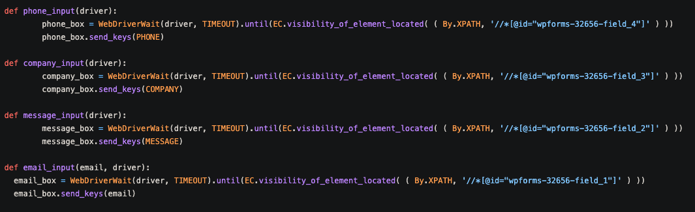

<!--
*** Thanks for checking out the Best-README-Template. If you have a suggestion
*** that would make this better, please fork the blog_1_selenium and create a pull request
*** or simply open an issue with the tag "enhancement".
*** Thanks again! Now go create something AMAZING! :D
***
***
***
*** To avoid retyping too much info. Do a search and replace for the following:
*** github_username, repo_name, twitter_handle, email, project_title, project_description
-->


<!-- PROJECT SHIELDS -->
<!--
*** I'm using markdown "reference style" links for readability.
*** Reference links are enclosed in brackets [ ] instead of parentheses ( ).
*** See the bottom of this document for the declaration of the reference variables
*** for contributors-url, forks-url, etc. This is an optional, concise syntax you may use.
*** https://www.markdownguide.org/basic-syntax/#reference-style-links
-->

[![Forks][forks-shield]][forks-url]
[![Stargazers][stars-shield]][stars-url]
[![LinkedIn][linkedin-shield]][linkedin-url]
[](https://lbesson.mit-license.org/)

<!-- PROJECT LOGO -->
<br />
<p align="center">
  <a href="https://github.com/MooseandSquvirrel/blog_1_selenium_form.git">
    
  </a>

  <h3 align="center">Code for Selenium Tutorial</h3>

  <p align="center">
  	The code to pair with my <a href="https://medium.com/@andygardnerucla/automate-your-work-with-selenium-2578d5bf61a8">Medium article</a> on how to begin automating with Selenium and WebDriver.
    <br />
    <a href="https://github.com/MooseandSquvirrel/blog_1_selenium_form.git"><strong>Explore the docs »</strong></a>
    <br />
    <br />
    <a href="https://medium.com/@andygardnerucla/automate-your-work-with-selenium-2578d5bf61a8">View Tutorial Article</a>
    ·
    <a href="https://github.com/MooseandSquvirrel/blog_1_selenium_form.git">View Code</a>
    ·
    <a href="https://www.youtube.com/watch?v=6n9ESFJTnHs&list=PLkqzviz5ifFKApVwHy71jHXIAcJ797lkR&index=42">View Modern Automation</a>
  </p>
</p>


<!-- TABLE OF CONTENTS -->
<details open="open">
  <summary><h2 style="display: inline-block">Table of Contents</h2></summary>
  <ol>
    <li>
      <a href="#about-the-project">About The Project</a>
      <ul>
        <li><a href="#built-with">Built With</a></li>
      </ul>
    </li>
    <li>
      <a href="#getting-started">Getting Started</a>
      <ul>
        <li><a href="#prerequisites">Prerequisites</a></li>
        <li><a href="#installation">Installation</a></li>
      </ul>
    </li>
    <li><a href="#usage">Usage</a></li>
    <li><a href="#license">License</a></li>
    <li><a href="#contact">Contact</a></li>
  </ol>
</details>


<!-- ABOUT THE PROJECT -->
## About The Project

<p align="center">
  <a href="https://github.com/MooseandSquvirrel/blog_1_selenium_form.git">
    
  </a>
</p>

Welcome welcome welcome! This is the supplementary code to pair with the Medium article I
wrote for beginning your journey automating with Selenium. Selenium is an incredibly fun and powerful 
open-source project that is traditionally used for QA testing. However, you can use it to build web bots that do almost whatever you can think of. 
This little bot simply shows the basics of how to select and fill out a form on a company website with a small commandline program using
Selenium's Python version.
<br />
<br />
To get a true in-depth, wordy, hand holding of step-by-step  how-to with this tutorial, visit:
<a href="https://medium.com/@andygardnerucla/automate-your-work-with-selenium-2578d5bf61a8">MY MEDIUM BLOG!</a>
<br />
<br />


### Built With

* [Python](https://www.python.org/)
* [Selenium](https://www.selenium.dev/)
* [Selenium's WebDriver](https://www.selenium.dev/documentation/en/webdriver/)


<!-- GETTING STARTED -->
## Getting Started

This tutorial is meant for folks who have a general understanding of how to navigate the terminal,
and those who also understand the basics of modern OOP languages like Python. Both of these only take a week 
or two to get comfortable enough with to begin your Selenium automation journey. So if you don't know
them yet don't fret! Links are actually provided to other Medium articles in my blog that have great suggestions of where
to begin studying those topics. That way you can return here and automate boring or tedious tasks with Selenium!

For those of you who are ready now, the article is way more informative and comprehensive than what below steps will be. Because it's
a tutorial walk-thru. 
<br/>
<br/>
Sooo... -> <a href="https://medium.com/@andygardnerucla/automate-your-work-with-selenium-2578d5bf61a8">Not the Article</a>
   :) 
<br/>

NOTE: This tutorial utilizes an actual company's form as an example. As stated in the blog, **Please don't
spam their inbox.** 


### Prerequisites

* Follow the Blog! Which again goes into much more thorough detail.
* Otherwise, you need to at the very least make sure to pip install these two packages:
  ```sh
  pip install selenium
  pip install webdriver-manager
  ```
* You will also have to get the driver executable that matches the browser you wish to automate or "drive".
* This tutorial utilizes Chrome so: <a href="https://chromedriver.chromium.org/downloads">ChromeDriver Executables Site</a>
* As mentioned in the "Set-up" section of that site, you must include the ChromeDriver location in your PATH environment variable.
* **If you don't add to the PATH the ChromeDriver will not begin and crash the code execution.** 
* This code uses Python 3. If you have a different version, you will need to adjust the command to execute the script as well as some other
tweaks that will become apparent with the error outputs. If you get stuck go to the tutorial or dive into the wonders of search engines!

### Installation

1. Git Clone.
   ```sh
   git clone https://github.com/MooseandSquvirrel/blog_1_selenium_form.git
   ```
2. Execute script.
   ```sh
   python3 selenium_blog_1.py
   ```
<br />
If packages are downloaded and WebDriver executable downloaded / added to PATH it should navigate to the form page, and fill out the form without submitting.
If you did not use Chrome as the browser you'll need to adjust line 8 as well as all correlating code that utilized that import.


<!-- USAGE EXAMPLES -->
## Usage



The usages for learning automation such as this small simple program are endless. It is entirely up to your creativity!
I have utilized bots to: speed up workflows in non-coding jobs, to simplify large tasks, and to even help with data analysis 
on massive projects that saved hundreds of hours of work for myself and my teams.

_For more examples, or info -> [Article Again](https://medium.com/@andygardnerucla/automate-your-work-with-selenium-2578d5bf61a8)_


<!-- LICENSE -->
## License

Distributed under the MIT License. See `LICENSE` for more information.


<!-- CONTACT -->
## Contact

Andy Gardner - web.dev.bud1@gmail.com

Project Link: [https://github.com/MooseandSquvirrel/blog_1_selenium_form.git](https://github.com/MooseandSquvirrel/blog_1_selenium_form.git)


<!-- MARKDOWN LINKS & IMAGES -->
<!-- https://www.markdownguide.org/basic-syntax/#reference-style-links -->
[forks-shield]: https://img.shields.io/github/forks/MooseandSquvirrel/blog_1_selenium_form.svg?style=for-the-badge
[forks-url]: https://github.com/MooseandSquvirrel/blog_1_selenium_form/network/members
[stars-shield]: https://img.shields.io/github/stars/MooseandSquvirrel/blog_1_selenium_form.svg?style=for-the-badge
[stars-url]: https://github.com/MooseandSquvirrel/blog_1_selenium_form/stargazers
[issues-shield]: https://img.shields.io/github/issues/MooseandSquvirrel/blog_1_selenium_form.svg?style=for-the-badge
[issues-url]: https://github.com/MooseandSquvirrel/blog_1_selenium_form/issues
[linkedin-shield]: https://img.shields.io/badge/-LinkedIn-black.svg?style=for-the-badge&logo=linkedin&colorB=555
[linkedin-url]: https://linkedin.com/in/MooseandSquvirrel
